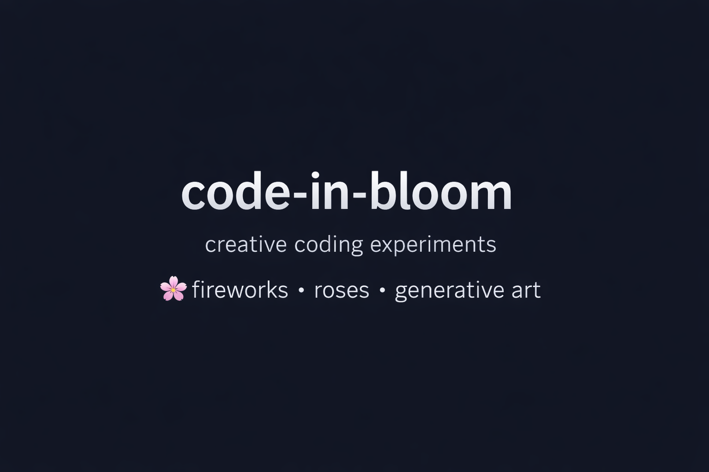
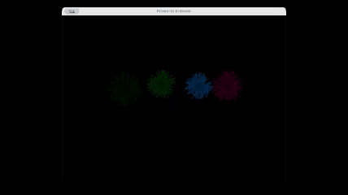
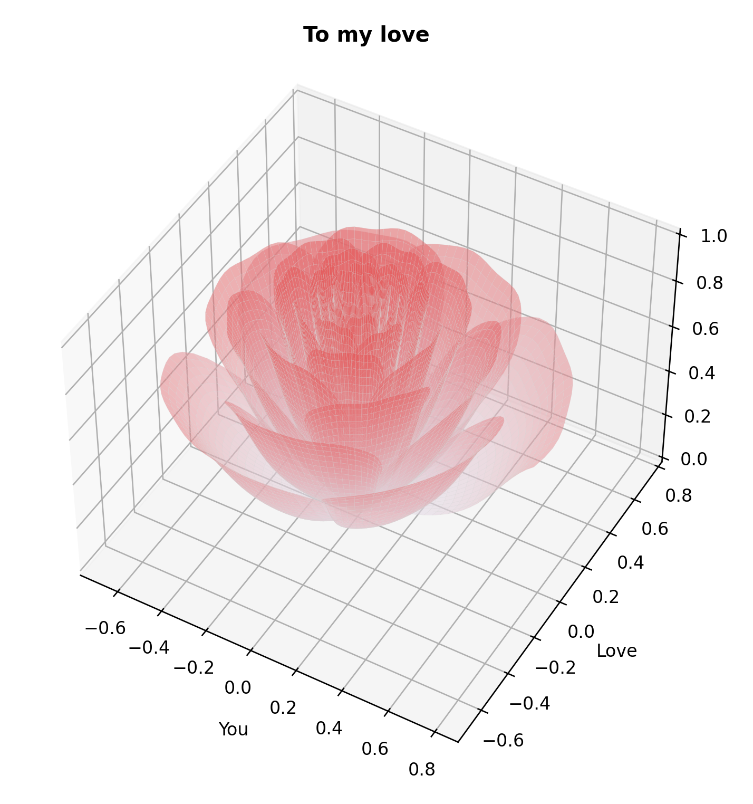

<p align="center">
  
</p>

<h1 align="center">🌸 code-in-bloom</h1>

<p align="center">
An evolving collection of creative coding experiments — fireworks, flowers, and poetic visuals in Python.
</p>

<p align="center">
<i>Where code blossoms into motion.</i>
</p>

---

# 🎆 Gallery

<p align="center">



</p>

<p align="center">
<b>Fireworks in Bloom</b><br>
A generative art experiment built with <b>Python + Pygame</b>, simulating synchronized firework bursts with particle trails and fading effects.
</p>

<br>

<p align="center">



</p>

<p align="center">
<b>Mathematical Rose</b><br>
A 3D mathematical rose generated using <b>NumPy + Matplotlib</b>, inspired by parametric surfaces and mathematical art.
</p>

---

# ✨ Features

- 🎇 Synchronized firework bursts
- 🎨 Color fading and particle trail effects
- 🌹 Mathematical generative art
- ⚡ Modular package structure
- 🌙 Smooth animation rendering
- 🌸 Designed for extensibility (flowers & future visual experiments)

---

# 🛠 Tech Stack

- Python 3.12+
- Pygame
- NumPy
- Matplotlib
- uv (modern Python package manager)

---

## 🚀 Setup

```bash
uv venv
source .venv/bin/activate
uv sync
```

▶ Run the Demos

Fireworks
```bash
uv run python examples/fireworks_show.py
```

Rose Visualization
```bash
uv run python examples/rose_show.py
```

<p align="center">
🌸 Built with curiosity, mathematics, and a bit of poetry.
</p>
```
